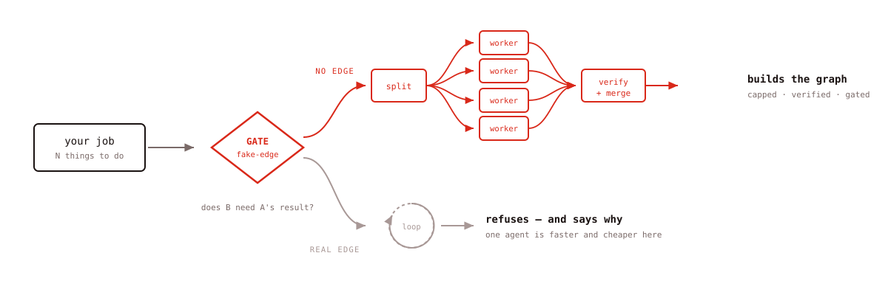
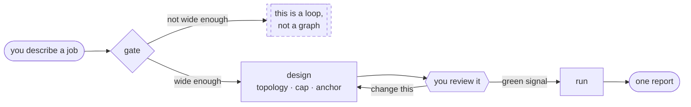
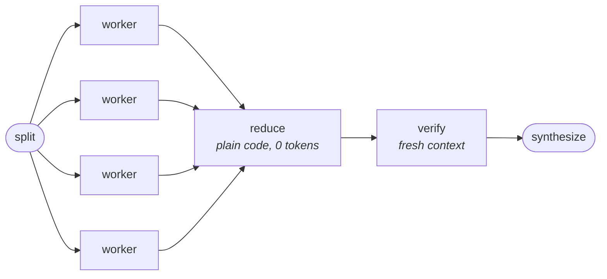

<div align="center">

<picture>
  <source media="(prefers-color-scheme: dark)" srcset="assets/mascot-dark.svg">
  
</picture>

# Graph Sorcerer

**Designs agent graphs — and tells you when you don't need one.**

[](LICENSE)
[](https://claude.com/claude-code)
[](#when-it-refuses-you)

<picture>
  <source media="(prefers-color-scheme: dark)" srcset="assets/hero-dark.svg">
  <source media="(prefers-color-scheme: light)" srcset="assets/hero-light.svg">
  
</picture>

</div>

---

## Install

```bash
claude plugin marketplace add Dibakar01/graph-sorcerer
claude plugin install graph-sorcerer@graph-sorcerer
```

Then just ask, in your own words. No keyword to memorise.

<sub>Costs **~130 tokens** of always-on context per session; the reference material loads only when a graph is actually warranted.</sub>

---

## It never starts a fleet on its own



A fleet spends real money in the background, and the failure is quiet — a graph pointed at the
wrong job returns a confident, complete, expensive, **wrong** report. So you approve the design
before anything spawns.

---

## The four checks

Any model parallelises when asked. These are what get skipped under time pressure.

| | Check | What it catches |
|:--:|---|---|
| ◇ | **Fake-edge test** | If B never reads A's output, that arrow is just the order you typed things in. Delete it, run both at once. |
| ⏱ | **Honest speedup** | Elapsed time is the critical path, not the sum — but the serial fraction sets the floor. 40% serial means infinite agents still only buy ~2.5×. You get the number, not a vibe. |
| ⊘ | **Verifier independence** | A checker that read the worker's chat inherited its errors. That's not a second measurement, it's the first one quoted twice. Fresh context, three *different* questions. |
| ⚓ | **An anchor** | A graph comparing its own outputs to its own outputs measures consistency and reports it as truth. More nodes = more confident, not more correct. |

Plus a **hard cap** — Claude Code's workflow-size setting is [advisory, not enforced](#notes-on-accuracy).

---

## The shape it builds



Fan out for breadth · reduce in code · verify on fresh context · synthesize once.
Cheap models on mechanical nodes, the strong one where judgment lives.

---

## When it refuses you

<table>
<tr><td width="50%">

**✗ It declines**

> Fix the failing test in `auth.spec.ts`

Read → diagnose → fix → re-run. Every step needs the last one's result. One agent is faster and cheaper.

</td><td width="50%">

**✓ It builds**

> Audit all 40 route files for missing auth

40 independent jobs, 2 real edges. Proposes a diamond, caps the first run at 20, flags any file that doesn't return.

</td></tr>
</table>

It also refuses when you want to approve every step, when you don't know what you're looking for
yet, or when the steps genuinely depend on each other.

> **The tell:** if no two jobs are independent, there's no graph to build. It's a loop — and a loop is fine.

---

## Test it yourself

```bash
claude plugin eval graph-sorcerer --max-cost-usd 2
```

Runs each case **with** the plugin and again **without**, then reports the delta. The interesting
one is `refuses-narrow-work`: the baseline arm happily fans out a one-file bug fix; the plugin arm
declines.

---

<details>
<summary><b>Notes on accuracy</b> — three things the source article gets wrong</summary>

<br>

The idea comes from Anatoli Kopadze's [*Graph Engineering explained*](https://x.com/AnatoliKopadze/status/2080668775796314331) — a genuinely good explainer, worth reading. Every mechanism here was re-verified against the CLI rather than taken from the article, which surfaced three corrections:

| | Correction |
|---|---|
| **The keyword moved** | The article says start your prompt with `workflow`. That was renamed to `ultracode` in CLI 2.1.160 — the changelog states plainly that "the word 'workflow' no longer triggers a run" — and a later build narrowed it further. Plain-language requests have worked throughout. **Don't rely on a magic word.** |
| **The size guideline is advisory** | `/config` → "Dynamic workflow size" is a hint to the model (default: under 15 agents), **not an enforced limit.** Write a real cap into the spec. |
| **Two patterns are now native** | `agent({schema})` gives an enforced node contract; `isolation: "worktree"` gives each worker its own git worktree. No need to hand-roll either. |

The underlying scheduling ideas are far older than the framing suggests — dataflow graphs, MapReduce, DAG orchestrators, and critical-path analysis from 1950s operations research. What's genuinely new is that the nodes are **non-deterministic and expensive**, which is why verification and cost caps have to be structural rather than best practice.

</details>

<details>
<summary><b>What's in the box</b></summary>

<br>

```
skills/graph-sorcerer/
├── SKILL.md              the gate and the judgment
└── references/
    └── patterns.md       verified CLI mechanics · the diamond skeleton
                          · fixes for the 3 ways graphs break
                          · 6 paste-ready spec templates
evals/
├── refuses-narrow-work/  the case that matters
├── builds-wide-work/
└── partial-mixed-work/
```

`patterns.md` loads only once a graph is warranted — the gate doesn't need it.

</details>

<details>
<summary><b>The three ways graphs break</b></summary>

<br>

| Failure | Fix |
|---|---|
| **Context collapse** — 1,000 outputs into one final step blows the window before synthesis starts | Layer the fan-in: batch, summarize each batch, combine the summaries |
| **False independence** — two nodes write the same file or hit the same rate-limited API. A hidden edge | Give every worker its own worktree; audit shared *resources*, not just shared data |
| **Silent node death** — one dead node among 200 slips into a report that looks complete | Every merge counts its inputs against what it expected, and flags the gap |

</details>

---

<div align="center">

**Requirements:** Claude Code 2.1+ · **Licence:** [MIT](LICENSE)

<sub>Proposing a change to the gate? Include an eval case that fails without it and passes with it —<br>a rule nobody can measure is a rule that quietly rots.</sub>

</div>
